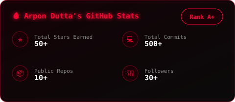
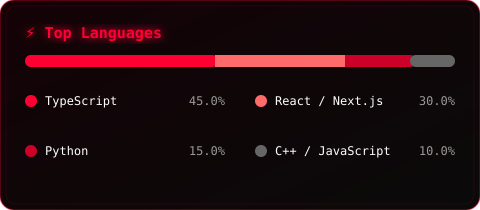
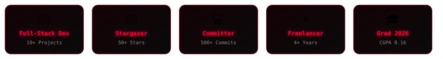

<div align="center">

<!-- ✨ Animated Banner ✨ -->
<a href="https://github.com/arpon-dutta07">
  
</a>

</div>

<br/>

<table align="center" border="0">
<tr>
<td width="50%" align="center" valign="middle">

<!-- 🖥️ Dev Setup -->


</td>
<td width="50%" align="center" valign="middle">

<!-- 🪪 Swinging Lanyard ID Card -->


</td>
</tr>
</table>

<br/>

<table align="center" border="0">
<tr>
<td valign="middle">

### 🚀 My Featured Creations

| 🎌 Project | 💻 Tech | ⭐ |
|:---|:---:|:---:|
| [⚡ AI Image Enhancer](https://github.com/arpon-dutta07/AI-Image-Enhancer) | `JavaScript` `AI/ML` | 25 |
| [🎨 AI Image Generator](https://github.com/arpon-dutta07/AI-Image-Generator) | `CSS` `GenAI` | 18 |
| [💻 macOS Portfolio](https://my-portfolio-eta-ecru-34.vercel.app/) | `React` `TS` `Tailwind` | 15 |
| [📄 AI Resume Analyzer](https://github.com/arpon-dutta07/AI-Resume-Analyzer) | `Python` `NLP` | 12 |
| [🎓 EduAI Teaching Platform](https://github.com/arpon-dutta07/EduAI-Teaching-Platform) | `Next.js` `TypeScript` | 10 |

<br/>

> 💗 *"I don't just write code, I engineer experiences."*

</td>
</tr>
</table>

<br/>

<div align="center">


<br/><br/>

<a href="https://github.com/arpon-dutta07">
  
</a>
<a href="https://github.com/arpon-dutta07?tab=followers">
  
</a>

</div>

<br/>

### 🖤 About Me

```yaml
name: Arpon Dutta
role: Full-Stack Developer & AI/ML Enthusiast
education: B.Tech CS (AI & ML) — Techno India University, Kolkata — CGPA 8.16
experience: 4+ years freelance (web dev, graphic design, video reels) — 10+ client projects
internship: Web Development Intern @ CodSoft
currently_building: macOS-style interactive portfolio (React + Vite + TS + Tailwind + Framer Motion)
location: Kolkata, India
```

---

### ⚙️ Tech Arsenal

<div align="center">


</div>

---

### 📊 GitHub Stats & Graphs

<div align="center">

<a href="https://github.com/arpon-dutta07">
  
</a>
<a href="https://github.com/arpon-dutta07">
  
</a>

</div>

---

### 🏆 GitHub Trophies

<div align="center">
<a href="https://github.com/arpon-dutta07">
  
</a>
</div>

---

### 🐍 Contribution Snake

<div align="center">
<picture>
  <source media="(prefers-color-scheme: dark)" srcset="https://raw.githubusercontent.com/arpon-dutta07/arpon-dutta07/output/github-contribution-grid-snake-dark.svg">
  
</picture>
</div>

---

### 📫 Connect

<div align="center">

[](https://my-portfolio-eta-ecru-34.vercel.app/)
[](https://www.linkedin.com/in/arpon-dutta-009a88360)
[](https://www.instagram.com/arpon_._dutta)
[](mailto:arpongen3094@gmail.com)
[](https://github.com/arpon-dutta07)

</div>


